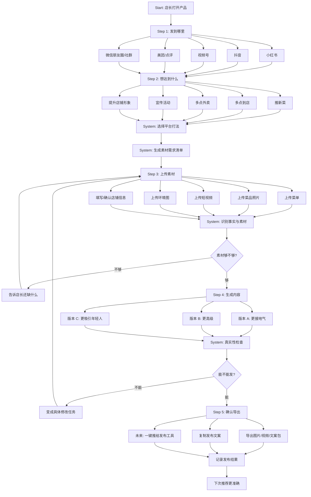
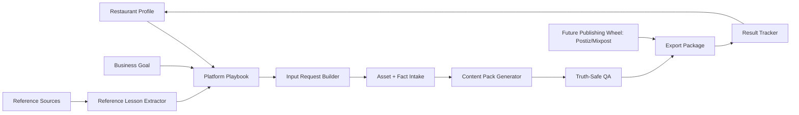
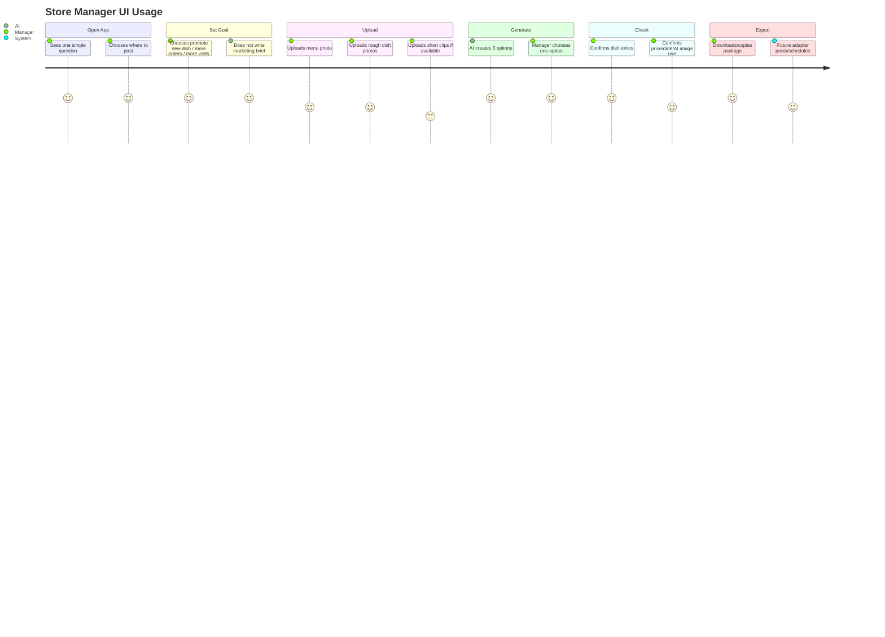
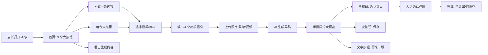

# AI Restaurant Content Assistant: Interaction Function Map and UI Usage Diagram

## 0. Product Positioning

This product is not a generic social media scheduler, not a marketing dashboard, and not a full restaurant operations platform.

It is:

> A simple AI content generation assistant for small restaurants. The owner chooses the platform and business goal, uploads minimal real information and rough photos/videos, then receives platform-ready content packages to post on the restaurant's own accounts.

The user is assumed to be:

- busy restaurant owner or store manager
- low digital literacy
- possibly older
- not trained in marketing
- comfortable with phone, WeChat, payment apps, merchant apps, and taking photos
- unwilling to learn campaign terminology, AI prompts, or social media strategy

## 1. Product Promise

User-facing promise:

> Tell us where you want to post and what you want to promote. We tell you what to upload, then generate photos, copy, video scripts, and export packages you can post.

Internal product promise:

> Platform-aware content generation with truth-safe restaurant asset handling.

## 2. Core User Flow

The UI must be five screens, not a dashboard.

```text
发到哪里
→ 想达到什么
→ 上传素材
→ 生成内容
→ 确认导出
```

For a merchant-app-style navigation, the product can also be expressed as:

```text
首页
创建
我的内容
客户/互动
更多
```

But the creation flow itself should stay five steps.

No default screen should show:

- campaign score
- reference lesson
- production mode
- generation brief
- asset taxonomy
- AI model name
- agent room
- crawler state
- raw database
- analytics dashboard

## 2.1 Mature Product Patterns To Copy

Subagent research compared merchant apps and small-business tools such as Taobao Flash Merchant, Toast, Square, WhatsApp Business, LINE Official Account, Meituan merchant flows, and open-source scheduling tools.

Patterns to copy:

1. Use task-first merchant language.
   - Good: 首页, 创建, 我的内容, 客户, 更多
   - Bad: Campaign Builder, Prompt, Model, Assets, Channels, Automation

2. Use progressive steps.
   - choose goal
   - fill basics
   - preview
   - confirm

3. Put AI inside familiar fields.
   - "帮我生成描述"
   - "帮我换个说法"
   - "帮我做封面"
   - not "open AI studio"

4. Let users start from familiar inputs.
   - upload photo
   - upload menu
   - choose existing dish
   - fill offer/price
   - choose where to post

5. Use review-before-send.
   - save
   - preview
   - confirm
   - publish/export

6. Convert all errors into one next action.
   - "Photo is missing" -> "Add a photo to continue"
   - "Price is unconfirmed" -> "Confirm price or remove price"
   - "AI image may mislead" -> "Confirm use or replace with real photo"

Patterns to avoid:

- prompt editor as primary UI
- model picker
- token settings
- aspect-ratio jargon
- advanced audience filters
- automation nodes
- analytics during creation

## 3. Full Interaction Function Diagram



## 4. Internal Function Architecture



### Module Responsibilities

| Module | User-facing meaning | Internal job |
| --- | --- | --- |
| Restaurant Profile | 我的店 | 店铺类型、档位、城市、菜品、目标用户、账号风格 |
| Platform Playbook | 这个平台怎么发 | 小红书/抖音/视频号/美团等平台打法 |
| Input Request Builder | 需要你上传什么 | 把平台打法翻译成菜单/照片/视频/事实需求 |
| Asset + Fact Intake | 传照片/菜单 | 接收粗素材，识别事实，标记风险 |
| Content Pack Generator | 生成内容 | 输出图片、文案、标题、视频脚本、封面 |
| Truth-Safe QA | 能不能发 | 防止假菜、错误价格、未确认活动、版权风险 |
| Export Package | 导出发布包 | 输出可复制/下载/推送到平台的内容包 |
| Result Tracker | 看效果 | 记录曝光、点赞、收藏、订单等结果 |

## 5. UI Usage Diagram



## 5.1 Store Manager Usage Diagram

This is the simplified usage path the actual restaurant manager should experience.



The creation screen should feel like filling a merchant app form, not operating creative software.

## 6. Screen 1: 发到哪里

### Purpose

Start from platform, because the user thinks in terms of "I want to post on my own account."

### Layout

```text
┌─────────────────────────────┐
│ 你今天想发到哪里？          │
│                             │
│ [小红书]  [抖音]            │
│ [视频号]  [美团/点评]       │
│ [朋友圈/社群]               │
│                             │
│ 不确定？帮我推荐            │
└─────────────────────────────┘
```

### Rules

- Do not show platform strategy here.
- Do not show account settings here.
- One tap selects platform.

### Internal Output

```ts
platform = 'xiaohongshu' | 'douyin' | 'wechat_channels' | 'meituan_dianping' | 'wechat_moments'
```

## 7. Screen 2: 想达到什么

### Purpose

Capture business goal without asking for a marketing brief.

### Layout

```text
┌─────────────────────────────┐
│ 你想让这条内容帮你做什么？  │
│                             │
│ [推新菜]                    │
│ [多点到店]                  │
│ [多点外卖]                  │
│ [宣传活动]                  │
│ [提升店铺形象]              │
│                             │
│ 下一步                       │
└─────────────────────────────┘
```

### Rules

- Maximum 5 goals.
- No "brand awareness", "conversion", "traffic" terms.
- The app can recommend a default if user is unsure.

### Internal Output

```ts
goal = 'new_dish' | 'more_visits' | 'more_delivery_orders' | 'event_promo' | 'brand_image'
```

## 8. Screen 3: 上传素材

### Purpose

Turn platform + goal into specific input tasks.

### Layout

```text
┌─────────────────────────────┐
│ 今天需要这些素材             │
│                             │
│ 1. 菜单照片                  │
│    用来确认菜名/价格         │
│    [上传]                    │
│                             │
│ 2. 招牌菜近照 3 张           │
│    手机随手拍也可以          │
│    [上传] [我没有]           │
│                             │
│ 3. 5 秒短视频                │
│    拍夹起/倒汁/上桌动作      │
│    [上传] [让 AI 帮我补]     │
│                             │
│ [素材够了，生成内容]         │
└─────────────────────────────┘
```

### Task Types

| Need | User wording |
| --- | --- |
| menu fact | 上传菜单照片 |
| dish proof | 拍这道菜 |
| venue mood | 拍店里环境 |
| motion shot | 拍 5 秒动作 |
| pricing | 确认价格能不能写 |
| event fact | 确认活动时间 |

### Rules

- Each upload task must explain why it is needed.
- Allow "我没有" so the flow does not dead-end.
- If user has no assets, generate a safe fallback package that does not pretend to be real dish photography.

## 9. Screen 4: 生成内容

### Purpose

Generate several simple choices, not a complex editor.

### Layout

```text
┌─────────────────────────────┐
│ 已生成 3 个版本              │
│                             │
│ A 更接地气                   │
│ [封面预览]                   │
│ 标题：深圳饭后第二场...      │
│ [用这版] [再来一版]          │
│                             │
│ B 更高级                     │
│ [封面预览]                   │
│ 标题：晚上的小吃和酒...      │
│ [用这版] [再来一版]          │
│                             │
│ C 更适合年轻人               │
│ [封面预览]                   │
│ 标题：这家酒吧可以认真吃...  │
│ [用这版] [再来一版]          │
└─────────────────────────────┘
```

### Generated Package Per Option

Each option includes:

- platform preview
- cover/title
- body copy
- image order
- short video script if needed
- caption/hashtag suggestions
- missing facts
- risk notes

### Rules

- Do not expose prompt engineering.
- Do not show long text first; show preview first.
- "再来一版" should preserve same platform + goal + assets.

## 10. Screen 5: 确认导出

### Purpose

Final human approval in concrete language.

### Layout

```text
┌─────────────────────────────┐
│ 发布前确认                   │
│                             │
│ ✅ 菜名已确认                │
│ ✅ 图片是你上传/AI修过的     │
│ ⚠ 价格还没确认，已不写价格   │
│ ⚠ 这张图是 AI 辅助生成       │
│    客人可能以为是真实菜图    │
│    [确认可用] [换成真实图]   │
│                             │
│ [导出小红书发布包]           │
│ [复制文案]                   │
└─────────────────────────────┘
```

### Export Package

For Xiaohongshu:

- cover image
- carousel images
- title
- body copy
- hashtags
- image order

For Douyin / Video Channels:

- cover image
- video script
- shot order
- subtitles
- caption

For Meituan / Dianping:

- dish/store image
- item title
- item description
- store description
- review reply drafts

### Rules

- Export cannot happen if required facts are unconfirmed and used in copy.
- Reference-only assets cannot export.
- AI generated food/drink/venue visuals must be explicitly confirmed or marked as support visuals.

## 11. Platform Playbook Matrix

| Platform | User goal | What system generates | Required inputs | Key metric |
| --- | --- | --- | --- | --- |
| 小红书 | 种草/收藏/到店 | 封面、标题、图文、图片顺序、关键词 | 菜品图、环境图、菜单事实 | 曝光、收藏、评论 |
| 抖音 | 短视频曝光/团购兴趣 | 15 秒脚本、镜头顺序、封面、字幕 | 5 秒动作视频、菜图、环境视频 | 播放、完播、点击 |
| 视频号 | 熟人/本地传播 | 短视频脚本、口播、封面、朋友圈文案 | 菜图、老板/员工动作、环境 | 播放、转发、私信 |
| 美团/点评 | 转化/搜索/信任 | 菜品主图、商品标题、描述、店铺图 | 菜品真实图、价格、菜单 | 点击、转化、订单 |
| 微信朋友圈/社群 | 老客提醒/活动 | 朋友圈文案、海报、社群话术 | 活动信息、菜图、价格 | 回复、到店、预订 |

## 12. What To Reuse From Open Source

| Need | Reuse candidate | How to use |
| --- | --- | --- |
| UI components | shadcn/ui | forms, cards, buttons, dialogs |
| video rendering | Remotion | render short content packages later |
| media processing | FFmpeg / ffmpeg.wasm | trim, resize, extract frame |
| scheduling/publishing | Postiz/Mixpost/TryPost | later adapter after export works |
| menu data schema | Open Menu Format ideas | menu normalization reference |
| image workflow lab | ComfyUI/Fooocus/A1111 | internal experiments only |

### Recommended Prototype Stack

```text
Next.js
+ shadcn/ui
+ React Flow
+ Uppy or UploadThing
+ Remotion later
+ Promptfoo / Langfuse later
+ Postiz/Mixpost adapter later
```

Use now:

- shadcn/ui for mobile-first forms, cards, dialogs, drawers, tabs, upload/review panels
- React Flow for the internal function/workflow diagram
- UploadThing for quick typed Next.js uploads, or Uppy if multi-source upload matters

Use later:

- Remotion for generated short-video preview/export
- Promptfoo for content/QA regression checks
- Langfuse for generation traces and human feedback
- Postiz/Mixpost/TryPost for publish/schedule handoff after export works

Do not fork now:

- Postiz
- TryPost
- Mixpost
- n8n
- Activepieces
- ComfyUI

Reason:

They are useful layers, but they are not the restaurant content assistant's core user experience.

## 13. What Not To Reuse As Core

Do not use scheduler products as the main product.

Reason:

They solve:

```text
I already have content, help me schedule it.
```

We solve:

```text
I do not know what content to make. Help me make it.
```

## 14. Minimum Functional Prototype

The first no-code/design prototype should demonstrate:

1. User selects platform.
2. User selects goal.
3. System asks for menu/photo/video inputs.
4. User uploads or marks missing.
5. System shows three generated versions.
6. User chooses one.
7. System shows truth-safe checklist.
8. User exports a platform package.

## 15. Prototype Acceptance Checklist

A restaurant manager should understand without explanation:

- where to start
- what to tap
- what to upload
- why the app asks for each photo
- what content was generated
- what cannot be published yet
- how to export

The prototype fails if the user asks:

- What is a campaign?
- What is a generation brief?
- What is QA status?
- What is reference-only?
- Why do I need to choose a production mode?

## 16. Next Design Artifacts

After this document, build:

1. Clickable Figma/mobile prototype.
2. Static HTML prototype.
3. Real app shell.

Recommended first visible screens:

```text
/start-platform
/start-goal
/inputs
/generate
/review-export
```

Do not build:

- raw dashboard
- crawler monitor
- agent room
- admin analytics
- scheduler calendar

until the store-manager flow is proven.
