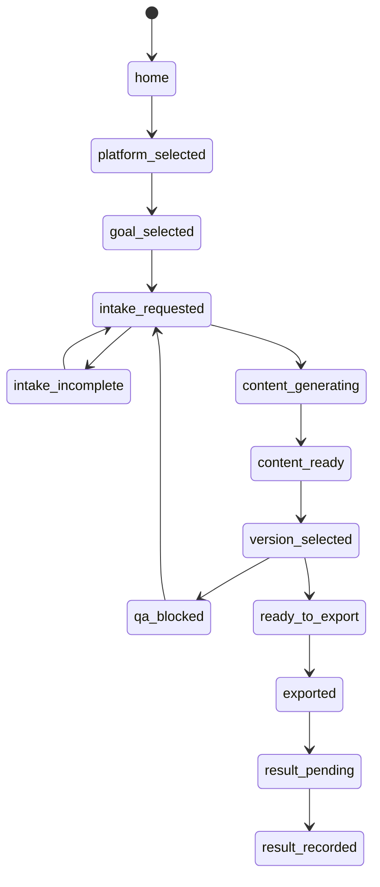

# AI Restaurant Content Assistant: Page-Level Logic Spec

## Purpose

This document turns the product idea into page-level logic that a frontend designer or engineer can implement without guessing.

The target user is a small restaurant owner or store manager with low digital literacy. The UI must behave like a merchant app, not a marketing console.

## Global Rules

1. Every screen has one primary action.
2. Every page error becomes one concrete next action.
3. No internal terminology appears in the store-manager flow.
4. The user can always save and leave.
5. The user can proceed with missing optional material, but cannot export misleading content.
6. Platform-specific optimization happens behind the scenes.
7. The system generates content for the restaurant's own accounts; it does not become a full platform management backend.

## Global Objects

```ts
type Platform =
  | 'xiaohongshu'
  | 'douyin'
  | 'wechat_channels'
  | 'meituan_dianping'
  | 'wechat_moments';

type Goal =
  | 'new_dish'
  | 'more_visits'
  | 'more_delivery_orders'
  | 'event_promo'
  | 'brand_image';

type IntakeItem = {
  id: string;
  label: string;
  whyNeeded: string;
  required: boolean;
  acceptedTypes: Array<'photo' | 'video' | 'menu' | 'text'>;
  status: 'missing' | 'uploaded' | 'skipped' | 'confirmed';
};

type ContentVersion = {
  id: string;
  styleLabel: '更接地气' | '更高级' | '更吸引年轻人';
  platform: Platform;
  title: string;
  copy: string;
  imageOrder: string[];
  videoScript?: string;
  warnings: string[];
};
```

## Page State Machine



## Page 0: 首页

### User Intent

"I opened the app. Tell me what to do."

### Show

- Today recommendation card.
- Create content button.
- My content entry.
- Optional reminder if unfinished draft exists.

### Primary Action

`用今天推荐`

### Secondary Actions

- `自己创建一条`
- `我的内容`

### Input

None.

### Output

Starts a draft content job with:

```ts
draft.source = 'today_recommendation' | 'manual_create'
```

### Empty State

If no restaurant profile exists:

```text
先告诉我你的店是做什么的
[填写店铺信息]
```

### Failure State

Do not show system failure. Show:

```text
今天推荐暂时生成不了，你可以自己创建一条。
[自己创建一条]
```

## Page 1: 发到哪里

### User Intent

"I know where I want to post."

### Show

- Xiaohongshu
- Douyin
- WeChat Channels
- Meituan/Dianping
- WeChat Moments/Groups
- "Not sure, recommend for me"

### Primary Action

Tap platform card.

### Input

```ts
platform?: Platform
```

### Output

```ts
draft.platform = selectedPlatform
```

### Logic

If user taps `帮我推荐`:

1. Check restaurant profile.
2. Check last goal if available.
3. Choose one default platform.
4. Explain in one sentence.

Example:

```text
建议先发小红书，因为你这次是推新菜，适合做图文种草。
```

### Validation

Cannot continue without platform.

### Error Copy

```text
先选一个平台，我才知道要帮你生成什么格式。
```

## Page 2: 想达到什么

### User Intent

"I know what I want this content to do."

### Show

- 推新菜
- 多点到店
- 多点外卖
- 宣传活动
- 提升店铺形象

### Primary Action

Tap goal card.

### Output

```ts
draft.goal = selectedGoal
```

### Logic

The selected platform and goal determine the platform playbook.

Examples:

| Platform | Goal | System chooses |
| --- | --- | --- |
| 小红书 | 推新菜 | cover + carousel + save-worthy copy |
| 抖音 | 多点到店 | 15-second motion script + hook |
| 视频号 | 宣传活动 | local social sharing script |
| 美团/点评 | 多点外卖 | menu image + dish title + dish description |

### Validation

Cannot continue without goal.

### Error Copy

```text
先选一个目标，我才能知道要帮你推什么。
```

## Page 3: 上传素材

### User Intent

"Tell me exactly what to upload."

### Show

Dynamic intake tasks from `PlatformPlaybook + Goal`.

Every task has:

- what to upload
- why it is needed
- upload button
- skip button if optional
- "I do not have this" button if required but replaceable

### Primary Action

`素材够了，生成内容`

### Input

```ts
draft.platform
draft.goal
restaurantProfile
existingAssets
```

### Output

```ts
draft.intakeItems[]
draft.uploadedAssets[]
draft.confirmedFacts[]
draft.missingInputs[]
```

### Intake Task Examples

#### Xiaohongshu + New Dish

```text
1. 菜单照片
   用来确认菜名/价格

2. 招牌菜照片 3 张
   用来做封面和图片顺序

3. 环境图 1 张
   用来证明这是你的店

4. 可选 5 秒视频
   用来生成短视频脚本
```

#### Meituan/Dianping + Delivery Orders

```text
1. 菜品真实照片
   用来做商品主图

2. 价格/套餐信息
   用来写商品标题和描述

3. 菜单分类
   用来优化店铺菜单结构
```

### Continue Rules

Continue is allowed if:

- required facts are confirmed or excluded from copy
- at least one usable real asset exists, or content is marked as "no real dish photo available"
- missing inputs can be handled safely

Continue is blocked if:

- user wants to promote a specific dish but has no dish name
- user wants to mention price but price is missing
- user wants event promotion but date/time is missing

### Error Copy

```text
还差一个菜名。没有菜名，我不能帮你写这道菜。
```

```text
价格还没确认。我可以不写价格，或者你现在补上。
```

## Page 4: 生成内容

### User Intent

"Show me usable options."

### Show

Three generated versions:

- A 更接地气
- B 更高级
- C 更吸引年轻人

Each version shows:

- platform preview
- title
- cover image or cover direction
- body copy
- image order
- video script if relevant
- warnings

### Primary Action

`用这版`

### Secondary Actions

- `再来一版`
- `改得更接地气`
- `改得更高级`
- `保存草稿`

### Input

```ts
draft.platform
draft.goal
restaurantProfile
uploadedAssets
confirmedFacts
missingInputs
```

### Output

```ts
contentVersions: ContentVersion[]
selectedVersion?: ContentVersion
```

### Generation Rules

The generator may:

- improve copy
- suggest image order
- generate cover text
- create crop/retouch instructions
- generate AI support visuals
- generate short video script

The generator may not:

- invent unavailable dish
- invent price
- invent event time
- use online reference image as final asset
- present AI-generated dish as real without confirmation

### Empty State

If assets are weak:

```text
素材不够强，但我可以先生成文案和拍摄建议。
[先生成文案] [回去补照片]
```

## Page 5: 确认导出

### User Intent

"Can I safely post this?"

### Show

- final preview
- fact checklist
- asset checklist
- AI image warning
- export buttons

### Primary Action

`确认导出`

### Secondary Actions

- `返回修改`
- `保存草稿`

### Input

```ts
selectedVersion
uploadedAssets
confirmedFacts
qaResult
```

### Output

```ts
exportPackage
```

### QA Rules

Export is blocked when:

- required fact is missing and used in copy
- online reference image is in final content
- AI generated dish/drink/venue image may mislead and is not confirmed
- no final content asset exists
- platform-specific required field is missing

Export is allowed when:

- all used facts are confirmed
- missing facts are removed from copy
- AI support visuals are disclosed internally and approved
- all final assets are owned/generated/approved

### Human Copy

Bad:

```text
needs_ai_asset_approval
```

Good:

```text
这张图经过 AI 生成/美化，客人可能以为是真实菜图。你确认可以用吗？
```

## Page 6: 我的内容

### User Intent

"Where are my drafts and exported posts?"

### Tabs

- 草稿
- 待确认
- 已导出
- 已发布
- 效果记录

### Card Fields

- platform
- goal
- content title
- status in human words
- missing action
- last updated

### Primary Actions

- `继续`
- `复制文案`
- `下载素材`
- `记录效果`

## Page 7: 效果记录

### User Intent

"Tell the system how this post performed."

### Show

Simple manual fields:

- 曝光量
- 点赞
- 收藏
- 评论
- 分享
- 订单/到店 if known
- simple rating: 不错 / 一般 / 不好

### Output

```ts
resultRecord = {
  platform,
  goal,
  contentVersionId,
  metrics,
  simpleRating,
}
```

### Future Automation

Later, metrics can be imported from:

- Postiz/Mixpost/TryPost adapter
- platform APIs
- manual screenshots
- OCR/import helpers

## Page-Level Route Plan

```text
/                         首页
/create/platform          发到哪里
/create/goal              想达到什么
/create/intake            上传素材
/create/generate          生成内容
/create/review            确认导出
/posts                    我的内容
/posts/:id                内容详情
/results/:id              效果记录
/more                     更多/设置
```

## Bottom Navigation

```text
首页
创建
内容
客户
更多
```

`客户` can be a placeholder in V1 if not implemented. It is included because merchant apps often reserve a customer/messages area, and it keeps the product familiar for future review/reply/comment flows.

## Implementation Priority

### Prototype 1

1. `/`
2. `/create/platform`
3. `/create/goal`
4. `/create/intake`
5. `/create/generate`
6. `/create/review`

### Prototype 2

1. `/posts`
2. `/results/:id`
3. `/more`

### Later

1. publish adapter
2. metrics import
3. customer/review reply
4. template library
5. restaurant profile onboarding

## Product Acceptance Tests

A restaurant manager should be able to complete this without explanation:

1. Choose Xiaohongshu.
2. Choose 推新菜.
3. Upload menu photo.
4. Upload 3 rough dish photos.
5. Tap generate.
6. Pick one of three versions.
7. Confirm facts.
8. Export package.

The UI fails if the manager asks:

- What is campaign?
- What is platform playbook?
- What is QA?
- What is prompt?
- Why are there so many choices?
