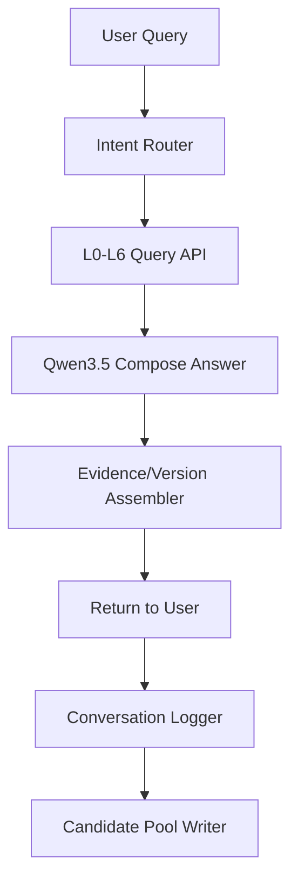

# Qwen3.5 Prompt 实现 + Dify Workflow 集成（V2.5）

## 1) Qwen3.5 提取Prompt（L0候选）

### System Prompt
```text
你是食品科学知识工程师。你的唯一目标是从输入文本提取“L0科学原理候选”。
严格要求：
1) 必须是机理性陈述，不要经验鸡汤。
2) 必须包含可测量参数（温度/时间/pH/浓度/aw 至少一个）。
3) 必须给出证据定位（书名、页码或章节、原文短引）。
4) 输出仅JSON，不要解释性文字。
```

### User Prompt 模板
```text
[任务]
从以下书籍片段提取L0候选，并区分非L0内容。

[元数据]
book_id={book_id}
book_title={book_title}
author={author}
chapter_id={chapter_id}
section_id={section_id}
page_range={page_range}

[输入文本]
{section_text}

[输出JSON Schema]
{
  "principles": [
    {
      "statement": "...",
      "mechanism": "...",
      "parameters": {
        "temperature_c": {"min": null, "max": null},
        "time_min": {"min": null, "max": null},
        "ph": {"min": null, "max": null},
        "water_activity": {"min": null, "max": null}
      },
      "boundary_conditions": ["..."],
      "evidence": {
        "source_type": "book_quote|paper_quote|table|figure",
        "locator": "chapter/page/figure",
        "quote": "<=120 chars"
      },
      "confidence": 0.0,
      "category": "protein|maillard|emulsion|fermentation|texture|other",
      "tags": ["..."],
      "non_l0_reason_if_any": null
    }
  ],
  "non_l0_content": [
    {"statement": "...", "reason": "经验总结/无参数/无机理/无证据"}
  ]
}
```

## 2) Qwen3.5 二次精炼Prompt（结构化入库）

### System Prompt
```text
你是L0结构化引擎。你将候选原理转换为可入库记录。
要求：保持事实，不补脑；参数单位统一；补充边界但不得虚构。
```

### User Prompt
```text
将以下candidate转为L0入库JSON。

候选:
{candidate_json}

输出字段:
{
  "principle_key": "snake_case",
  "claim": "...",
  "mechanism": "...",
  "control_variables": {...},
  "expected_effects": [...],
  "boundary_conditions": [...],
  "counter_examples": [...],
  "evidence_level": "low|medium|high",
  "confidence": 0.0,
  "citations": [
    {"source_title": "...", "source_type": "book|paper", "locator": "...", "evidence_snippet": "..."}
  ]
}
```

## 3) Qwen3.5 冲突判定Prompt（去重/冲突）

```text
你是L0冲突审核助手。
输入: 新候选 + 已有相似L0列表。
输出:
{
  "action": "merge|new_version|new_record|need_evidence",
  "reason": "...",
  "conflict_fields": ["temperature_c", "ph"],
  "review_priority": "high|medium|low"
}
```

## 4) Dify Workflow 集成（主链路）

## 节点图（推荐）


## 节点说明
1. `Intent Router`：判定走 L0/L1/L2/L3/L4/L6 的优先级。
2. `L0-L6 Query API`：返回证据、版本、置信度。
3. `Compose Answer`：Qwen3.5 结合证据生成答案。
4. `Evidence Assembler`：统一附加 `source + version + used_l0_ids`。
5. `Conversation Logger`：记录全量问答。
6. `Candidate Pool Writer`：沉淀可复用知识候选（不直入L0）。

## 5) Dify HTTP节点入参/出参契约

### 入参（to query API）
```json
{
  "query": "如何让鸡汤更清澈且有胶质？",
  "user_id": "u_001",
  "session_id": "s_20260302_01",
  "preferred_cuisine": "CN",
  "max_evidence": 5
}
```

### 出参（from query API）
```json
{
  "answer_context": {
    "facts": ["..."],
    "strategies": ["..."],
    "flavor_mapping": ["..."]
  },
  "used_l0_ids": ["L0-BIO-PROT-001"],
  "sources": [
    {"title": "On Food and Cooking", "locator": "p47", "version": "1.2"}
  ],
  "confidence": 0.88
}
```

## 6) Dify 最终回复模板（强制可追溯）
```text
结论：{short_answer}

依据：
- {fact_1}（{source_1}）
- {fact_2}（{source_2}）

参数建议：
- 温度：{temp}
- 时间：{time}
- 边界：{boundary}

证据与版本：
- used_l0_ids: {ids}
- sources: {sources}
- confidence: {confidence}
```

## 7) 失败与降级
- Qwen超时：返回最近已发布策略 + 降级说明
- 无证据：拒绝“确定性结论”，改为“待验证建议”
- 冲突证据：同时展示两种结论并标注适用边界
